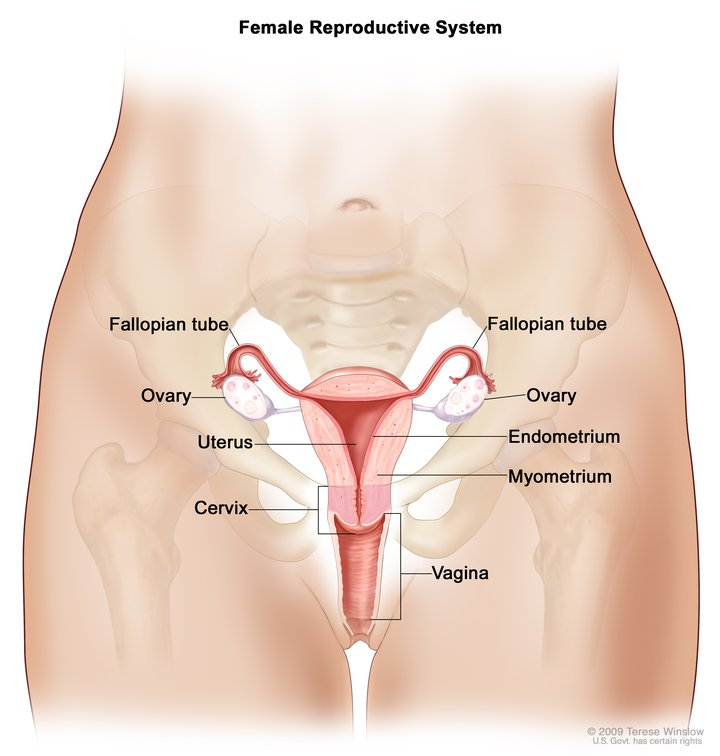

--- 
title: "Cervical Cancer"
author: "Jiawen Zhou, Lea Benyamin and Yuxin Cui"
date: "`r Sys.Date()`"
site: bookdown::bookdown_site
---

# Introduction

Cancer is a disease caused by the uncontrollably growth and spread of body's cells. Some types of cancers are only feminine, because linked to the female body such as the gynecologic cancer. Gynecologic cancer is any cancer that starts in a woman’s reproductive organs. Cancer is always named for the part of the body where it starts. Gynecologic cancers begin in different places within a woman’s pelvis, which is the area below the stomach and in between the hip bones.

{width=50%}

Cervical cancer, ovarian cancer, uterine cancer, vaginal cancer and vulvar cancer are gynecologic cancers. Our study will focus on cervical cancer. 

Cervical cancer facts: All women are at risk for cervical cancer. It occurs most often in women over age 30 (CDC). At least half of sexually active people will have HPV at some point in their lives, but few women will get cervical cancer. Cervical cancer is less known than breast cancer but it is the 4th more important cancer for women. So, it would be helpful to learn risk factors of cervical cancer to prevent such disease.

- What is the age distribution of people diagnosed with cervical cancer? Is there any relation between age and cervical cancer?
- How do STD and other reported diseases or medical conditions relate to cervical cancer? What are the top 3 common diseases common with cervical cancer?
- How do non-disease behaviors, including sexual intercourse, smoking, hormonal contraceptives, IUD relate to cervical cancer?

In the following chapters, we will discuss these questions.

For more details of this project, click [the link here](https://github.com/BenyaminLea/CervicalCancer) or copy the url https://github.com/BenyaminLea/CervicalCancer and open it in browser to go to our Github repository and navigate code in .Rmd files.
